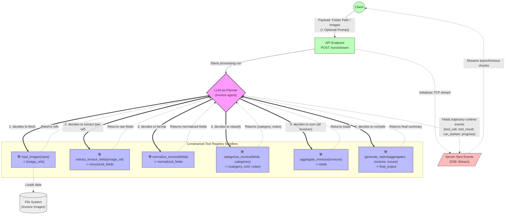

# Agent Architecture and Data Flow

This document details the layout of the LLM-as-Planner agent architecture and tool availability mapping for the local invoice-processing pipeline.

## Architectural Diagram

## Component Details

*   **LLM-as-Planner**: The orchestrating model (`invoice-agent`) dynamically evaluates intermediate tool results to determine the next action. It is NOT a static DAG pipeline, so if an extraction step fails or misses a field, the planner can voluntarily attempt a retry before progressing.
*   **Tool Registry Constraints**: The agent itself does not possess direct file I/O capabilities. It strictly acts through defined Python tools ensuring predictability and sandboxed operations.
*   **Data Flow & Real-Time Feedback**: Instead of generating an upfront batch response, the backend synchronously streams agent trajectory logs via `Server-Sent Events` (SSE). This includes every active step ranging from `run_started` to granular `tool_result` items, yielding the final payloads on stream completion.
